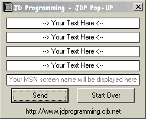



## a \*\*\*\!\*\*\*a JD Programming \- JDP Pop\-UP a\*\*\*\!\*\*\* a

### Description

This will display four MSN Messenger screen names for the user to read.

But please note that this is only for MSN Messenger 4.6 or lower because I am working on a one for the new Messenger. Also you will not be able to view the names which you sign on as, but the user will be able too. .:JamesJD:.
 
### More Info
 

             |
---                |---
**Submitted On**   |2002-11-08 21:25:04
**By**             |[JamesJD](https://github.com/Planet-Source-Code/PSCIndex/blob/master/ByAuthor/jamesjd.md)
**Level**          |Beginner
**User Rating**    |5.0 (15 globes from 3 users)
**Compatibility**  |VB 6\.0
**Category**       |[Internet/ HTML](https://github.com/Planet-Source-Code/PSCIndex/blob/master/ByCategory/internet-html__1-34.md)
**World**          |[Visual Basic](https://github.com/Planet-Source-Code/PSCIndex/blob/master/ByWorld/visual-basic.md)
**Archive File**   |[aa\_JD\_Prog1493931182002\.zip](https://github.com/Planet-Source-Code/jamesjd-a-a-jd-programming-jdp-pop-up-a-a__1-40527/archive/master.zip)

